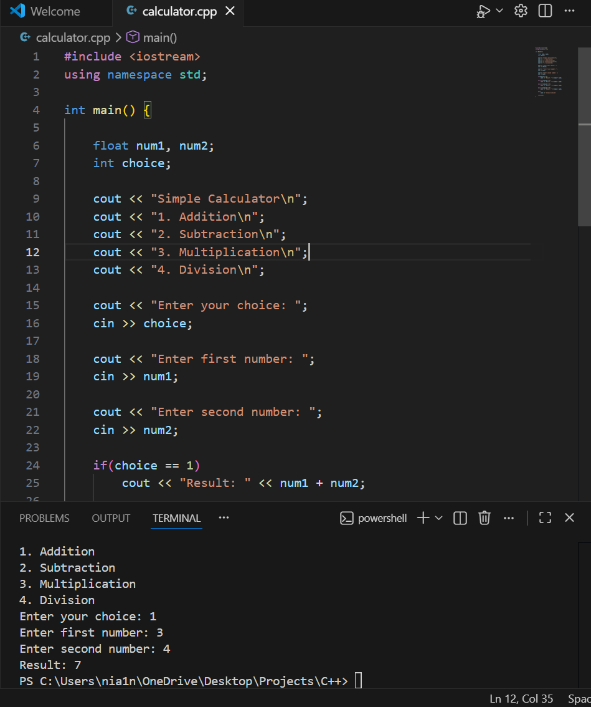

# C++ Calculator

A simple console-based calculator built using C++.
The program allows users to perform basic arithmetic operations.

## Features

* Addition
* Subtraction
* Multiplication
* Division
* Menu-based user input

## Technologies Used

* C++
* Standard Input/Output (`cin`, `cout`)
* Conditional Statements (`if-else`)

## How to Run

Compile the program:

g++ calculator.cpp -o calculator

Run the program:

.\calculator

## Example Output

Simple Calculator

1. Addition
2. Subtraction
3. Multiplication
4. Division

Enter your choice: 1

Enter first number: 10
Enter second number: 5

Result: 15

## Concepts Demonstrated

* Basic C++ syntax
* User input/output
* Conditional statements
* Simple menu-driven programs

## Author

Surya
